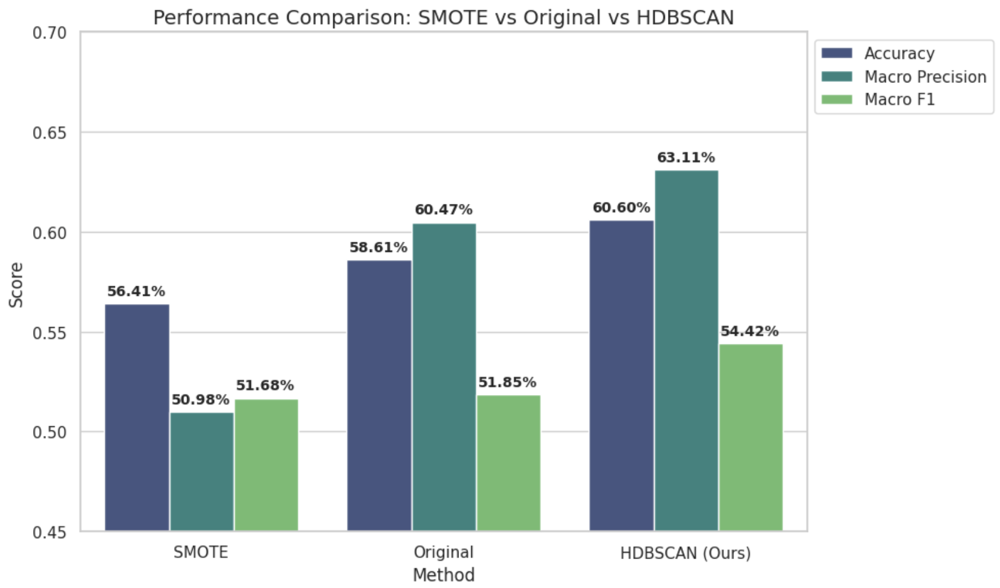
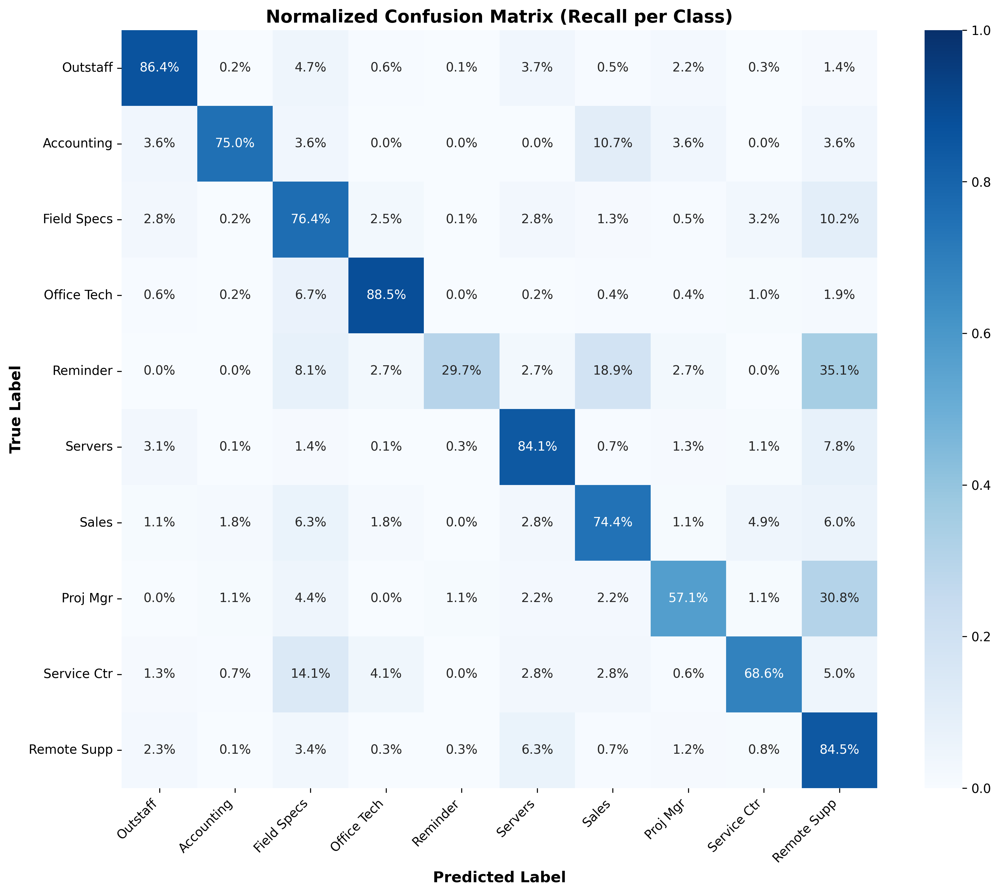

# Data-Centric Pipeline for Short Text Classification (ITSM)

## Abstract

This project implements a multi-stage classification pipeline designed for high-noise environments with extreme class imbalance (Long Tail distribution), typical for IT Helpdesk systems. 
Instead of synthetic data generation (SMOTE), which was found to propagate noise, a **Data-Centric approach** was developed. The solution utilizes **Density-Based Filtering (HDBSCAN)** to remove stochastic noise from the training set, followed by a two-level Stacking Ensemble.

**Key Achievement:** The pipeline improved Top-3 Accuracy to **97.4%** on production data, enabling automated "User Hints" with minimal error rate.

---

## Methodology & Architecture

The architecture consists of three sequential stages:

### 1. Data Preparation & Balancing
* **Quota-Based Sampling:** Applied a power-law smoothing algorithm to handle the 220:1 class imbalance. This preserved the "tail" of rare classes while downsampling majority classes without losing representativeness.
* **Deduplication:** Implemented **SimHash** (n-grams, distance $\le$ 3 bits) to remove fuzzy duplicates and prevent data leakage between train/validation sets.

Fig 1. Impact of Quota-Based Sampling. Left: Original distribution (Log Scale) showing extreme imbalance. Right: Balanced distribution (Linear Scale) used for training.*

### 2. Density-Based Filtering (The Core Innovation)
*Hypothesis:* In short texts (logs), noisy labels harm model performance more than lack of data.
* **Vectorization:** Texts were encoded using a domain-adapted **XLM-RoBERTa Large** model.
* **Dimensionality Reduction:** PCA (1024 $\to$ 64 components) retained 95% variance while densifying the space.
* **Clustering:** Applied **HDBSCAN**. Samples identified as noise (Label -1) were removed (~16.5% of dataset).
* **Result:** Removing noise proved superior to Oversampling methods.

*Fig 2. Comparison of strategies. The Data-Centric approach (HDBSCAN) significantly outperforms Baseline and SMOTE.*

### 3. Feature Engineering & Stacking (L2)
Final classification is performed by an Ensemble (Stacking) combining:
* **Semantic Enrichment:** Heuristic augmentation of short texts (<10 words) with metadata (e.g., "Parent Task", "Category Tag") to provide context for the attention mechanism.
* **Level-1 Models (Base Learners):**
    * *Linear:* Logistic Regression on Char-level and Word-level TF-IDF (robust to typos).
    * *Neural:* Fine-tuned XLM-RoBERTa (captures deep semantics).
* **Level-2 Meta-Classifier:** **XGBoost** trained on OOF (Out-of-Fold) predictions from L1 models + target-encoded company profiles and domain keywords.
* **Optimization:** Hyperparameters tuned via **Optuna**.

---

## Results (Production Test Set)

The model was evaluated on a held-out test set of 15,000 requests imitating real production flow (Known Clients / Cleaned Data).

| Metric | Value | Business Interpretation |
| :--- | :--- | :--- |
| **Top-1 Accuracy** | **81.7%** | Fully automated routing accuracy. |
| **Top-3 Accuracy** | **97.4%** | Success rate for "Suggested Departments" UI. |
| **ROC-AUC** | **0.961** | High separability of classes. |

### Confusion Matrix
The normalized matrix demonstrates high recall across both majority (Remote Support) and minority classes, validating the effectiveness of the balancing strategy.

---

## Tech Stack

* **Language:** Python
* **NLP:** `Transformers` (HuggingFace), `Stanza`, `SimHash`
* **ML & Stacking:** `CatBoost`, `XGBoost`, `Scikit-learn`
* **Unsupervised:** `HDBSCAN`
* **Optimization:** `Optuna`

---
## Author
Bassar Baishev
